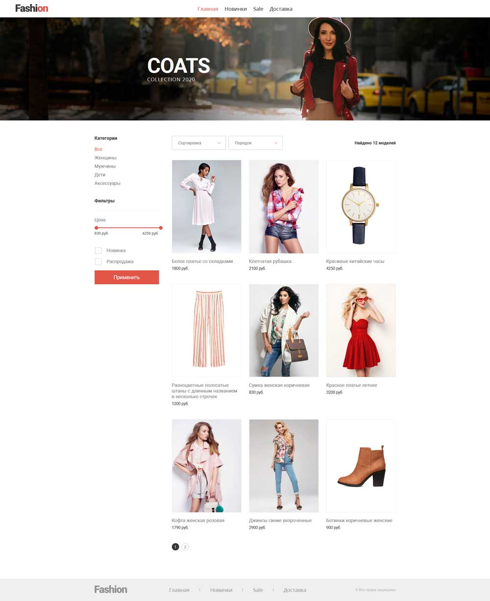

### Движок интернет-магазина в функциональном стиле
***

#### Возможности

Пользовательская часть

* Заказ товаров в гостевом режиме без регистрации
* Выбор способа оплаты и доставки
* Фильтры по категориям, новинкам, распродаже, цене
* Сортировка по цене и названию, по возрастанию и убыванию
* Возможность комбинировать любые фильтры
* Расчёт стоимости заказа в зависимости от цены и типа доставки
* Пагинация

Админская часть

* Просмотр заказов и изменение статуса
* Добавление, редактирование удаление товаров
* Возможность добавления товара в несколько категорий
* Разделение ролей админа и оператора

#### Технические решения

* Архитектура MVC
* ЧПУ, единая точка входа
* Роутинг на регулярных выражениях
* Создание заказов, добавление и редактирование товаров через ajax
* Авторизация с созданием токена и сохранением данных о сессии
* Шаблонизатор

Для установки скопировать файлы в главную директорию, импортировать дамп БД, прописать настройки БД в файле config/config.php. В демо-данных логин админа admin@mail.ru, логин оператора operator@mail.ru, пароль 123456. Вход в админ-панель /admin/

Системные требования - PHP 7.2 и выше, браузер с поддержкой JavaScript в синтакисе ES6 (транспиллинг, минификация фронтенд-части не проводились).